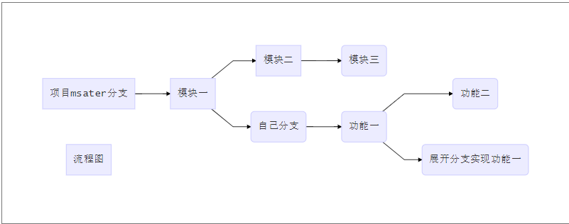

::: tip
git 本地操作
:::

<!-- more -->

## 基本操作

- 最基本流程：创建工作目录 对工作目录进行修改
  - `git add ./` 相当于执行了 `git hash-object -w` 文件名(修改多少个工作目录中的文件 此命令就要被执行多少次) `git update-index`...
  - git commit -m "注释内容" 相当于执行了 `git write-tree`和`git commit-tree`
- 初始化新仓库：`git init`
- 将修改添加到暂存区：`git add ./`
- 将暂存区提交到版本库：`git commit -m "注释"`
- 检查文件的状态：`git status`
  - 工作目录下的文件两种状态：跟踪和未跟踪
  - 未跟踪可以通过 add 文件名跟踪，变为已暂存状态，或者 add 所在目录 ,add 所在目录，该目录所有文件都变为已跟踪，并变为已暂存
  - 跟踪分为 已提交，已修改(又变为未跟踪)，已暂存
  - 已暂存通过`git commit -m "xx"`状态成为已提交
- 查看已暂存和未暂存的更新：`git diff`
  - 查看已暂存未提交的：`git diff --cached` 或 `git diff --staged`
- 提交更新：`git commit -m "注释内容"`，直接 `git commit`进入 vim 中编写注释
- 跳过暂存区：`git commit -a -m "注释"`，或`git commit -a`没有跟踪过的不能执行这个命令
- 删除 rm ，这条记录也会保存 再 git add ./ ,git commit 或者直接 git rm，git commit
- 重命名 mv
- 查看历史记录：git log,
  - 按下往下翻，q 退出
  - git log --pretty=oneline 一行显示
  - git log --oneline 简写

## 分支操作

- 概念： 使用分支可以从开发主线中离开，以免影响开发主线，分支就是一个活动的指针，指针就是在提交对象前，默认有一个主线分支 master，每次提交指针都会跟着提交对象的更新而移动到最新位置，refs 文件夹和 HEAD 文件夹存储着指针信息，总之分支是指向最新提交对象的一个指针(HEAD)，本质是指向提交对象的可变指针
- 创建分支：创建一个可以移动的新的指针，会在当前所在的对象上创建一个指针
- 分支操作
  - `git branch name` 创建一个新分支，并不会切换到新分支中
  - `git branch` 查看分支列表
  - `git branch -d name` 删除某一分支，不能自己删除自己，在删除分支时要处在别的分支
  - `git branch -v` 查看每一个分支的最后一次提交
  - `git branch -m oldbranch newbranch` 重命名本地分支
  - `git branch name commitHash` 新建一个分支并使指针指向对应的提交对象
  - `git branch --merged` 查看哪些分支已经合并到当前分支,在这个列表中分支名字前没有`*`号的分支通常可以使用，在这个列表可以删除某一个指针，`git branch -d name`
  - `git branch --no-merged` 查看所有未合并工作的分支，这个列表中删除会失败，如果真要删除，`-D`强制删除
- 其他分支操作
  - 查看当前分支所指对象 `git log --oneline --decorate`
  - 切换到某分支 `git checkout name` 分支切换会改变工作目录中的文件，如果到一个久的分支，工作目录会恢复到该分支最后一次提交时的样子，如果 git 不能干净利落的完成这个任务，将会禁止切换分支
    每次切换分支前，先提交一下当前分支
  - 查看项目分叉历史 `git log --oneline --decorate --graph --all`
- 配别名
  - 不想每次输入完整的命令可以配置别名 `git config --global.alias 简化名 完整名` 运行时 git 简化名，完整名多个参数需要加双引号
- 创建一个新分支并切换新分支：`git checkout -b name`
- 切换分支需要动三个地方：HEAD 指针，暂存区，工作目录，每次切换前，当前分支一定要是干净的（已提交），若在分支新创建一个文件未跟踪，再切换到其他支线或主线时，这个文件会在你切换的那个线出现，影响其他线正常工作，再切回到分支，把这个文件已暂存(git add)而没有提交，这个文件依然还会在你切换的那个线出现，除非把那个文件暂存并提交，文件才不会出现在其他线上，若修改这个文件，未暂存，再切换分支，则不允许切换分支

## 合并分支

- `git merge 分支名`，所在支线或主线合并指定支线，合并完可以直接删除所指定的分支，不用`-D`
- 典型合并：同一条线上的合并为快进式的合并，当合并的不在同一条线上时，git 会使用另个分支的末端所指的快照以及这两个分支的工作祖先，做一个三方合并，将其结果做了快照并自动创建一个新的提交对象指向它，这个被称作一次合并提交，它特别之处在于不止有一个父提交
- 冲突：合并过程中，在不同的分支对同一个文件同一部分进行了不同的修改，git 无法干净的合并他们，需要处理，简单的办法就是 商量好修改 并`git add ./`
- 长期分支：
  
  - 自己的分支为长期分支，做一个功能自己见一个分支，最后合并到自己的分支再把开辟出的分支删除，形成链式，topic 称为特性分支
- 分支原理
  - .git/refs 目录保存了分支及其对应的提交对象，heads 保存了分支对应的提交对象的 hash
  - HEAD 文件是一个符号的引用，指向目录所在的分支，符号的引用是一个指向其他引用的指针
  
## git 存储

- 当工作到一半时需离开，但是又不想提交，这时可以存储
- 命令：`git stash` 会将未完成的修改保存到一个栈上，可以随时重新应用这些改动
- 查看存储：`git stash list`
- `git stash apply` 应用这些修改
- `git stash drop`加上将要移除的存储的名字`stash@{0}`来移除它 0 表示第一项
- `git stash pop` 应用存储然后立即从栈中移除，上面二合一

## 回退

- 展开完整的操作：`git reflog`
- 工作区：如何撤销自己在工作目录中的修改
  - `git restore filename(文件名)` 或者`git checkout --filename(文件名)`
- 暂存区：如何撤销自己的暂存
  - `git restore --staged filename(文件名)`
- 版本库：如何撤销自己的提交
  - 只有注释写错了，才能撤销自己的提交，本质是重新提交，命令 `git commit --amend`,重新写注释，第一次改完时 git add ./ 再修改改完时没有 git add./ 直接提交 commit，这个时候要在想该注释，需要 git add ./ 再 git commit --amend 修改

## reset

- `git reflog`:主要是 HEAD 有变化 那么`git reflog`则会记录下来
- `git reset --soft commithash` 只动 HEAD(带着分支一起移动)
- `git reset --mixed commithash` 动 HEAD(带着分支一起移动) 动了暂存区
- `git reset --hard commithash` 动 HEAD(带着分支一起移动) 动了暂存区 动了工作目录
- `git checkout commithash` & `git --hard commithash`,前者只动 HEAD --hard 动 HEAD 而且带着分支一起走，checkout 对工作目录是安全的 --hard 是强制覆盖工作目录

## 数据恢复

- 找到需要恢复的提交对象 hash，`git checkout commithash`并在其下创建一个新分支

## 打 tag

- git 可以给历史中的某个提交打上标签，比较有代表性的是会用这个功能标记发布总结（v1.0）等
  - 列出标签 `git tag`,`git tag -l v1.8.5*`匹配所有 v1.8.5 版本的
  - 创建标签，分为两类轻量标签与附注标签，前者像一个不会改变的分支，是一个待提交的引用`git tag v1.0`，当前分支打上标签，不会随指针移动,也可以通过 hash 打上标签, git tag v1. b76fd8f
  - 查看特定标签 `git show v1.0`
  - 删除标签 `git tag -d v1.0`
  - 检出标签 `git checkout v1.0`,查看某个标签指向的文件版本，可以用 git chekout 命令，如果需要进入该版本修改，可以已 `git checkout -b "v1.0"`

## git 特点

- 直接记录快照，而非差异比较
- 近乎所有操作都是本地执行
- 时刻保持数据完整性
- 多数操作仅添加数据
- 文件的三种状态

## git 分支本质

- 本质是多个提交对象的集合，单个提交对象是一个快照，所有的分支都会有机会被 HEAD 所引用，HEAD 一个时刻只会指向一个分支，当有新的提交对象的时候，HEAD 会携带当前持有的分支往前移动
