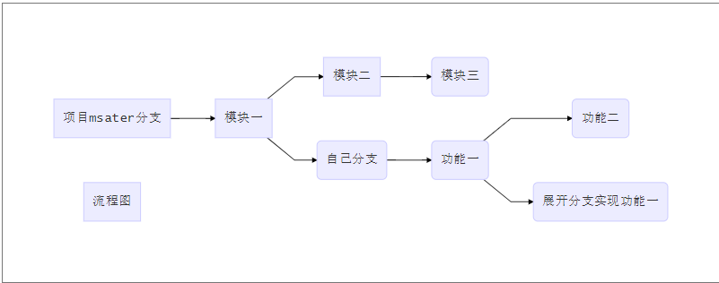

::: tip
git 远程仓库及操作
:::

<!-- more -->

## 远程仓库

### 图解

### 创建本地仓库

- git init
- git add
- git commit -m "xxx"

### 配置远程仓库(配别名和用户信息)

- 添加一个新的远程仓库：`git remote add [remote name] github上的https`
- 显示远程仓库使用的 git 别名与 url：`git remote -v`
- 查看远程仓库更多信息：`git remote show [remote name]`
- 重命名：`git remote rename [old remote name] [new remote name]`
- 移除一个远程仓库 `git remote rm [remote name]`
- 查看远程所有分支,r为remote `git branch -r`
- 查看本地和远程的所有分支，a为all `git branch -a`
- 删除远程分支，删除后还需推送到服务器 `git branch -d -r <branchname>`
- 删除后推送至服务器 `git push origin:<branchname>`

### 推送本地仓库到远程仓库

- `git push -u [remote name] [branch name]`

### 克隆远程仓库到本地

- git clone url(克隆时不需要 `git init`)默认克隆时为远程仓库起的别名为 origin，想要修改这个名字可以 `git clone -o name`

### 邀请成员加入团队

- 去远程仓库项目设置中的 collaboration 去邀请

### 拉取最新更新

- `git fetch [remote name]` 将某个远程主机的更新全部取回本地
- `git fetch [remote name] [branch name]` 取回特定分支的更新，可以指定分支名
- `git log -p FETCH_HEAD` 查看刚取回的更新信息
- `git merge [branch name]` 当前分支合并远程分支

### 流程

- 初始化远程仓库：一定要初始化一个空的仓库，在 github 上操作
- 创建本地仓库
  - `git remote add 别名 仓库地址(https)`
  - `git init` :复制源码
  - 修改用户名 修改邮箱
  - `git add`
  - `git commit`
- 推送本地仓库到远程仓库
  - 清理 Windows 凭据
  - `git push -u [remote name] [branch name]` (会弹出输入框，用户名，密码)推送完后会附带生成远程跟踪分支
- 项目邀请成员
  - 在 github 上操作
- 成员克隆远程仓库
  - `git clone 仓库地址` 在本地生成了.git 文件 默认为远程仓库配了别名 origin，只有在克隆的时候 本地分支 和 远程跟踪分支是有同步的关系
- 成员做出贡献
  - 修改源码文件
  - `git add`
  - `git commit`
  - `git push` (会弹出输入框，用户名，密码)推送完后会附带生成远程跟踪分支

## 推送其他分支

- 想要公开分享一个分支时，需要将其推送到有写入权限的远程仓库上，本地的分支并不会自动与远程仓库同步，必须显式地推送要分享的分支
- 推送本地的 serverfix 分支，将其作为远程仓库的 serverfix 分支：`git push origin serverfix`
- 不想这个分支叫这个可以更改：`git push origin serverfix:修改名`
- 拉取远程仓库 origin 有而本地没有的数据 `git fetch origin`
- 合并到当前所在分支：`git merge serverfix`
- 建在远程跟踪分支之上：`git checkout -b [branch] [remotename]/[branch]`

## 跟踪分支

- 从远程跟踪分支检出一个本地分支会自动创建一个跟踪分支，只有主分支并且克隆时才会自动建跟踪分支，跟踪分支是与远程分支有直接关系的本地分支
  - 在一个跟踪分支上输入 `git pull`，git 能自动识别去哪个服务器上去抓取，合并到哪个分支
  - 完整用法 `git pull [remote name] [remote branch]:[branch]` 拉取远程分支与本地某个分支合并
  - 冒号后可省略 `git pull [remote name] [remote branch]`拉取远程分支与此分支合并
  - 完整 pull 用法与这两个操作一致`git fetch [remote name] [remote branch]:[branch]` `git merge [branch]`，但建议用后两个
  - 可以设置其他跟踪分支 `git checkout -b branch remotename/branch`
  - 可以设置其他跟踪分支：`git checkout --track origin/serverfix`
  - 设置本地分支与远程分支不同名字： `git checkout -b sf origin/serverfix`
  - 若已有本地分支跟踪一个刚刚拉取下来的远程分支，要修改正在跟踪的分支，可以使用 `-u` 选项运行`git branch`显示设置: `git branch -u origin/serverfix`
  - 查看设置的所有跟踪分支：`git branch -vv`

## 远程跟踪分支

- 远程跟踪分支是远程分支状态的引用，他们是不能移动的本地分支，当做任何网络通信操作时，会自动移动，以 remote/tranch 形式命名，如 origin/master
- 当克隆一个仓库时，自动会创建一个跟踪 origin/master 的 master 分支
- 例子：从一个 git 服务器那里克隆，git 的 clone 命令自动将其命名为 origin，创建一个指向它的 master 分支的指针，本地会将其命名为 origin/master，同时本地也命名一个 master 分支，与 origin/master 分支指向同一个地方

## 本地分支

- 正常的数据推送 和拉取步骤
  - 确保本地分支已经跟踪了远程跟踪分支
  - 拉取数据： git pull
  - 上传数据： git push
- 本地分支怎么去跟踪一个远程跟踪分支
  - 当克隆的时候 会自动生成一个 master 本地分支(已经跟踪了对应的远程跟踪分支)
  - 在新建其他分支时 可以指定想要跟踪的远程跟踪分支
    `git checkout -b [branch] [remotename]/[branch]`
    `git checkout --track [remotename]/[branch]`
  - 将一个已经存在的本地分支改为一个跟踪分支
    `git branch -u [remotename]/[branch]`

### 冲突

- push 冲突:商量修改文件 `git add ./`
- pull 冲突:商量修改文件 `git add ./`

### 删除远程分支

- 删除：`git push origin -d serverfix`
- 列出仍在远程跟踪但是远程已被移除的无用分类：`git remote prune origin --dry-run`
- 清除上面命令列出来的远程跟踪：`git remote prune origin`

## pull request 流程

- 概念：可以进行 fork 派生，人们可以将修改推送到派生出的项目副本中。并通过创建合并请求 pull request 让他们的修改进入源版本库
- 从 master 分支创建一个新分支，提交修改，分支推送到 github，创建一个合并请求，讨论，最后项目拥有者合并或关闭你的合并请求

## SSH 密钥

- 生成密钥：c`md 命令： ssh-keygen -t rsa -C 邮箱地址`
- 生成私钥和公钥，把公钥贴到 github 中
